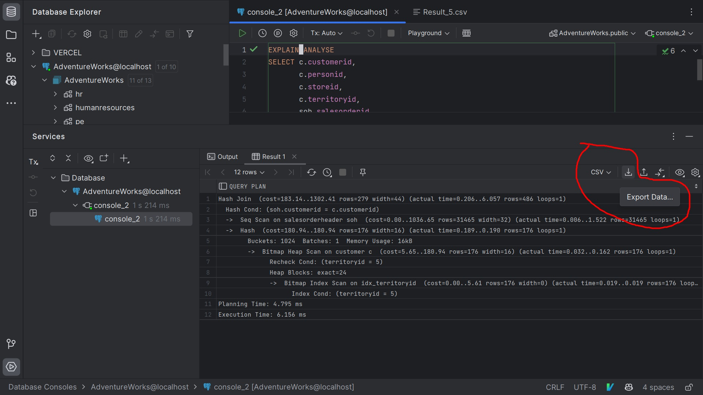

# Zadanie 1- EXPLAIN ANALYSE

### 1. Wywolanie SELECTA z tresci zadania

```sql
EXPLAIN ANALYSE
SELECT c.customerid,
       c.personid,
       c.storeid,
       c.territoryid,
       soh.salesorderid,
       soh.orderdate,
       soh.duedate,
       soh.shipdate
FROM sales.customer c
         INNER JOIN sales.salesorderheader soh ON c.customerid = soh.customerid
WHERE c.territoryid = 5;
```

### 2. Zapisanie wyniku zapytania do pliku .cvv w programie DataGrip



### 3. Dodanie indexow

```sql
CREATE INDEX idx_customerid ON sales.customer (customerid);
CREATE INDEX idx_territoryid ON sales.customer (territoryid);
CREATE INDEX idx_orderdate ON sales.salesorderheader (orderdate);
```

### 4. Wyexportowane wyniki `EXPLAIN ANALYSE`:

Znajdują się w katalogu `/Cwiczenia_9/Zadanie_1_wyniki_explain_analyse/`

Odnosniki:

1. [Bez indexow](./Zadanie_1_wyniki_explain_analyse/ExplainAnalyzeResult_without_indexes.csv)
2. [Z indexami](./Zadanie_1_wyniki_explain_analyse/ExplainAnalyzeResult_with_indexes.csv)

### 5. Porownanie wynikow

| lp  | Roznica                  | Bez indexow              | Z indexami         |
| --- | ------------------------ | ------------------------ | ------------------ |
| 1   | Planowany czas           | 0.179 ms                 | 2.685 ms           |
| 2   | Czas wykonania           | 6.268 ms                 | 4.865 ms           |
| 3   | Ilosc linijek logow      | 10                       | 12                 |
| 4   | Struktura danych         | Sequence                 | Bitmap Heap        |
| 5   | Metoda segregacji danych | filtracja                | ekstrakcja         |
| 6   | Wynik segregacji         | skasowano 19 644 rekordy | wybrano 24 rekordy |
