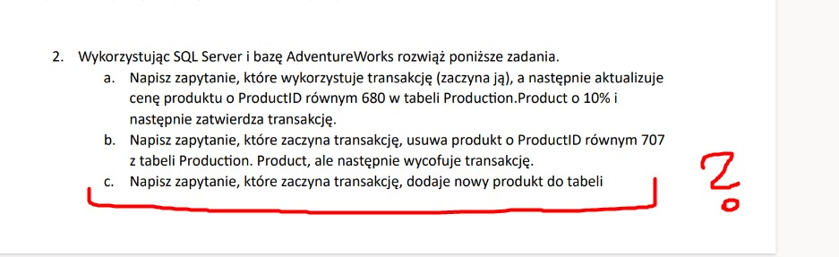

# Zadanie 2- Transakcje

### 1. Napisz zapytanie, które wykorzystuje transakcję (zaczyna ją), a następnie aktualizuje cenę produktu o ProductID równym 680 w tabeli Produc`on.Product o 10% i następnie zatwierdza transakcję.

```sql
BEGIN;
    UPDATE production.product SET listprice = 1.1* listprice
    WHERE production.product.productid = 680;
COMMIT;
```

### 2. Napisz zapytanie, które zaczyna transakcję, usuwa produkt o ProductID równym 707 z tabeli Produc`on. Product, ale następnie wycofuje transakcję.

```sql
BEGIN;
    DELETE FROM production.product
    WHERE production.product.productid = 707;
ROLLBACK;
```

### 3. ⚠️ Instrukcja do podpunktu niekompletna


